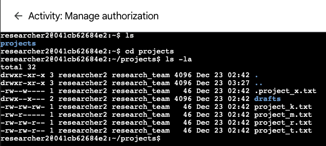
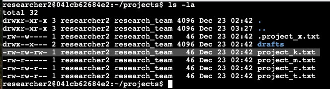
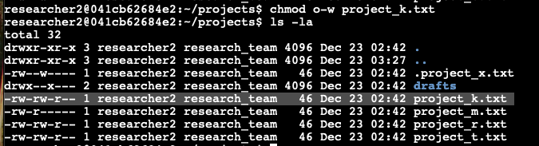
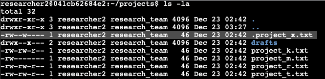
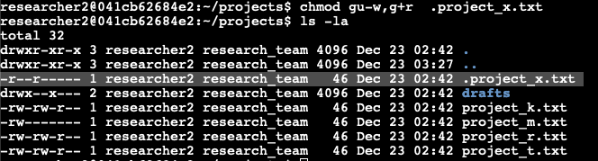

# Cybersecurity Projects Portfolio 

## Introduction 

I am a motivated IT professional with a degree in Digital Forensics & Incident Response, and a strong passion for cybersecurity. While I may not have formal work experience yet, I have built a solid foundation through my education, personal projects, and hands-on simulated exercises. On this page, you'll find a curated collection of projects that showcase my theoretical knowledge and practical skills—particularly in areas like SIEM tools, network security, and threat detection strategies. My goal is to demonstrate my commitment to identifying and preventing cyber threats, and I look forward to exploring opportunities where I can contribute to securing digital infrastructures.

## Table of Contents

- [Project 1: Professional Statement](#project-1-professional-statement)
- [Project 2: Conduct a security audit](#project-2-conduct-a-security-audit)
- [Project 3: Analyzing network intrusion structure and security response to a security incident](#project-3-analyzing-network-intrusion-structure-and-security-response-to-a-security-incident)
- [Project 4: Use Linux commands to manage file permissions](#project-5-use-linux-commands-to-manange-file-permissions)
- [Project 5: Applying filters to SQL queries](#project-4-applying-filters-to-sql-queries)
- [Project 6: Analyze vulnerable system for a small business](#project-6-analyze-vulnerable-system-for-a-small-business)
- [Project 7: Document an incident with an incident handlers journal](#project-7-document-an-incident-with-an-incident-handlers-journal)
- [Project 8: Update a file through a Python algorithm](#project-8-update-a-file-through-a-python-algorithm)

## Projects Section

## Project 1: Professional Statement

I am a cybersecurity professional with strong problem-solving abilities, excellent communication skills (both written and verbal), and technical expertise in Python and network security. I am passionate about protecting organizations from evolving digital threats and ensuring the privacy and security of sensitive information. My strengths in analytical thinking, time management, and ethical practices allow me to respond effectively to security challenges while upholding the highest standards of integrity. By leveraging my skills in proactive threat detection and response, I can help organizations build robust security infrastructures, minimize risk, and maintain trust. I am particularly interested in working with organizations that prioritize innovation in cybersecurity tools, aligning my passion for defense strategies with their goal of securing digital assets. As I continue to develop my skills, I aim to contribute to a safer, more secure digital world.

---

## Project 2: Conduct a security audit

### Scenario Background

  
Click to view the scenario details

  **Scenario:**  
  Botium Toys is a small U.S. business that develops and sells toys. With a single physical location serving as the main office, storefront, and warehouse, the company's growing online presence now attracts customers both in the U.S. and internationally. The IT department is under pressure to support global operations, so the IT manager initiated an internal audit using the NIST CSF framework. The audit focuses on assessing the security program, ensuring compliance with regulations, and identifying potential risks that could affect business operations.

### Risk Assessment Report

  
Click to view the risk assessment report

  **Scope and Goals of the Audit:**  
  - **Scope:** Entire security program at Botium Toys, including all assets and internal processes related to controls and compliance best practices.  
  - **Goals:** Assess current assets, complete the controls and compliance checklist, and determine necessary improvements to enhance security posture.

  **Current Assets:**  
  - On-premises equipment for in-office business needs.  
  - Employee equipment: desktops, laptops, smartphones, etc.  
  - Storefront products for retail sale (on-site and online).  
  - Management of various systems (accounting, security, ecommerce, etc.).  
  - Internet access, internal network, data retention and storage, and legacy system maintenance.

  **Risk Assessment:**  
  - **Risk Description:** Inadequate asset management and missing controls/compliance measures.  
  - **Risk Score:** 8/10 (high), due to lack of proper controls and adherence to best practices.  
  - **Additional Comments:**  
    - All employees have access to sensitive data.  
    - Lack of encryption for customer data, particularly credit card information.  
    - Missing access controls, disaster recovery plans, IDS, and centralized password management.  
    - Adequate physical security measures (locks, CCTV, fire systems) are in place.

### Controls Assessment Checklist

| Control                            | Status | Explanation                                                                                                                                                                                                                             |
|------------------------------------|--------|-----------------------------------------------------------------------------------------------------------------------------------------------------------------------------------------------------------------------------------------|
| Least Privilege                    | No     | Currently all employees have access to customer data; privileges need to be limited to reduce the risk of a breach.                                                                                                                     |
| Disaster Recovery Plans            | No     | There are no disaster recovery plans in place. These need to be implemented to ensure business continuity.                                                                                                                               |
| Password Policies                  | No     | Employee password requirements are minimal, which could allow a threat actor to more easily access secure data or other assets.                                                                                                            |
| Separation of Duties               | No     | Needs to be implemented to reduce the possibility of fraud/access to critical data, as the company CEO currently runs day-to-day operations and manages payroll.                                                                      |
| Firewall                           | Yes    | The existing firewall blocks traffic based on an appropriately defined set of security rules.                                                                                                                                           |
| Intrusion Detection System (IDS)   | No     | The IT department needs an IDS in place to help identify possible intrusions by threat actors.                                                                                                                                          |
| Backups                            | No     | The IT department needs to have backups of critical data to ensure business continuity in case of a breach.                                                                                                                               |
| Antivirus Software                 | Yes    | Antivirus software is installed and monitored regularly by the IT department.                                                                                                                                                          |
| Manual Monitoring Maintenance      | Yes    | Legacy systems are monitored and maintained, but there is no regular schedule or clear intervention procedures, which could place these systems at risk of a breach.                                                                 |
| Encryption                         | No     | Encryption is not currently used; implementing it would provide greater confidentiality of sensitive information.                                                                                                                     |
| Password Management System         | No     | There is no password management system currently in place; implementing this control would improve productivity during password issues.                                                                                                 |
| Locks (offices, storefront, warehouse) | Yes    | The store’s physical location, which includes the company’s main offices, storefront, and warehouse, has sufficient locks.                                                                                                                 |
| Closed-circuit Television (CCTV)   | Yes    | CCTV is installed and functioning at the store’s physical location.                                                                                                                                                                     |
| Fire Detection/Prevention Systems  | Yes    | Botium Toys’ physical location has a functioning fire detection and prevention system.                                                                                                                                                 |

### Compliance Checklist

#### Payment Card Industry Data Security Standard (PCI DSS)

| Best Practice                                                                 | Status | Explanation                                                                                                                          |
|-------------------------------------------------------------------------------|--------|--------------------------------------------------------------------------------------------------------------------------------------|
| Only authorized users have access to customers’ credit card information.       | No     | Currently, all employees have access to the company’s internal data.                                                                 |
| Credit card information is stored, accepted, processed, and transmitted securely. | No     | Credit card information is not encrypted, and all employees currently have access to it.                                               |
| Implement data encryption procedures to secure credit card transactions.      | No     | The company does not use encryption to ensure the confidentiality of customers’ financial information.                              |
| Adopt secure password management policies.                                   | No     | Password policies are minimal, and no password management system is currently in place.                                               |

#### General Data Protection Regulation (GDPR)

| Best Practice                                                | Status | Explanation                                                                                                                          |
|--------------------------------------------------------------|--------|--------------------------------------------------------------------------------------------------------------------------------------|
| E.U. customers’ data is kept private/secured.                | No     | The company does not currently use encryption to ensure confidentiality of sensitive information.                                   |
| There is a plan to notify E.U. customers within 72 hours if a breach occurs. | Yes    | There is a plan in place for notifying E.U. customers within 72 hours of a data breach.                                               |
| Ensure data is properly classified and inventoried.         | No     | Current assets have been listed but not classified.                                                                                 |
| Enforce privacy policies, procedures, and processes.         | Yes    | Privacy policies, procedures, and processes have been developed and enforced among IT team members and other employees.              |

#### System and Organizations Controls (SOC Type 1, SOC Type 2)

| Best Practice                                        | Status | Explanation                                                                                                                                       |
|------------------------------------------------------|--------|---------------------------------------------------------------------------------------------------------------------------------------------------|
| User access policies are established.              | No     | Controls of Least Privilege and separation of duties are not in place; all employees have access to internally stored data.                        |
| Sensitive data (PII/SPII) is confidential/private.   | No     | Encryption is not currently used to ensure the confidentiality of PII/SPII.                                                                       |
| Data integrity ensures the data is consistent, complete, and accurate. | Yes    | Data integrity measures are in place.                                                                                                             |
| Data is available only to individuals authorized to access it. | No     | Data is currently available to all employees; authorization needs to be limited to those who require access for their job functions.              |

### Sources

- **NIST Cybersecurity Framework (CSF):** [NIST Cybersecurity Framework](https://www.nist.gov/cyberframework)
- **NIST Special Publication 800-53 (Security Controls):** [NIST SP 800-53 Revision 5](https://csrc.nist.gov/publications/detail/sp/800-53/rev-5/final)
- **Payment Card Industry Data Security Standard (PCI DSS):** [PCI Security Standards Council](https://www.pcisecuritystandards.org/pci_security/)
- **General Data Protection Regulation (GDPR):** [European Commission – Data Protection](https://ec.europa.eu/info/law/law-topic/data-protection_en)
- **SOC Reporting Guidelines (AICPA):** [AICPA SOC for Service Organizations](https://www.aicpa.org/interestareas/frc/assuranceadvisoryservices/socforserviceorganizations.html)

---
## Project 3: Analyzing network intrusion structure and security response to a security incident

  
<strong>Scenario</strong>

You are a cybersecurity analyst working for a multimedia company that offers web design, graphic design, and social media marketing solutions to small businesses. Your organization recently experienced a DDoS attack that compromised the internal network for two hours until it was resolved.

During the attack, the organization’s network services suddenly stopped responding due to an overwhelming flood of ICMP packets. Normal internal network traffic could not access any network resources. The incident management team responded by blocking incoming ICMP packets, shutting down non-critical network services, and restoring critical services.

The cybersecurity team later investigated the event and discovered that a malicious actor had sent a flood of ICMP pings into the company’s network through an unconfigured firewall. This vulnerability allowed the attacker to overwhelm the network with a distributed denial-of-service (DDoS) attack.

To address this security event, the network security team implemented:
- A new firewall rule to limit the rate of incoming ICMP packets.
- Source IP address verification on the firewall to detect spoofed IP addresses.
- Network monitoring software to detect abnormal traffic patterns.
- An IDS/IPS system to filter out suspicious ICMP traffic.

As a cybersecurity analyst, you are tasked with using this event to create a plan to improve your company’s network security, following the National Institute of Standards and Technology (NIST) Cybersecurity Framework (CSF).

### Incident Report Analysis

| **Phase**     | **Key Points** |
|---------------|----------------|
| **Summary**   | The network experienced a major outage triggered by a DDoS attack via ICMP flooding. Critical services were disrupted until the incident was contained. |
| **Identify**  | A coordinated ICMP flood attack impacted routers, switches, and servers. Unusual traffic patterns alerted the team to the event. |
| **Protect**   | The team promptly tightened firewall rules to limit ICMP traffic and activated IDS/IPS systems to filter suspicious packets. |
| **Detect**    | Continuous monitoring quickly revealed abnormal traffic spikes, enabling rapid identification of affected systems. |
| **Respond**   | Affected network segments were isolated, malicious traffic was blocked, and essential services were prioritized for restoration. Detailed logs were captured for further analysis. |
| **Recover**   | System services were restored step-by-step. The incident prompted updates to disaster recovery plans and firewall configurations to better mitigate future risks. |
| **Reflections/Notes** | This event underscored the importance of proactive monitoring and well-defined incident response procedures. Future improvements will focus on preventing similar occurrences. |

### Sources

- **NIST Cybersecurity Framework (CSF):** [NIST CSF](https://www.nist.gov/cyberframework)
- Additional reference materials on DDoS attacks and incident response best practices.

---

## Project 4: Use Linux commands to manage file permissions

### Project Description
As a security professional, ensuring proper file permissions is essential for maintaining the security and integrity of organizational systems. In this activity, I examined and updated file and directory permissions using Linux commands to align with organizational policies. These tasks demonstrated practical experience in managing file authorizations to support secure collaboration.

### Check File and Directory Details
The following command demonstrates how I used Linux commands to determine the existing permissions set for a specific directory in the file system.

ls -la projects

The first line of the screenshot displays the command I entered, and the other lines display the output. The code lists all contents of the projects directory. I used the ls command with the -la option to display a detailed listing of the file contents that also returned hidden files. The output of my command indicates that there is one directory named drafts, one hidden file named .project_x.txt, and five other project files. The 10-character string in the first column represents the permissions set on each file or directory.

### Describe the Permissions String

The 10-character string can be deconstructed to determine who is authorized to access the file and their specific permissions. The characters and what they represent are as follows:
- **1st character:** This character is either a `d` or a hyphen (`-`) and indicates the file type.  
  - If it’s a `d`, it’s a directory.  
  - If it’s a hyphen (`-`), it’s a regular file.
- **2nd-4th characters:** These characters indicate the read (`r`), write (`w`), and execute (`x`) permissions for the user.  
  - A hyphen (`-`) in place of any of these indicates that the permission is not granted to the user.
- **5th-7th characters:** These characters indicate the read (`r`), write (`w`), and execute (`x`) permissions for the group.  
  - A hyphen (`-`) in place of any of these indicates that the permission is not granted for the group.
- **8th-10th characters:** These characters indicate the read (`r`), write (`w`), and execute (`x`) permissions for others (all other users on the system apart from the user and group).  
  - A hyphen (`-`) in place of any of these indicates that the permission is not granted for others.

For example, if the file permissions for `project_t.txt` are `-rw-rw-r--`:
- The first character is a hyphen (`-`), indicating that `project_t.txt` is a regular file, not a directory.
- The second, fifth, and eighth characters are `r`, which means that the user, group, and others all have read permissions.
- The third and sixth characters are `w`, which means that only the user and group have write permissions.
- No execute permissions are granted for `project_t.txt`.

### Change file permissions

The organization determined that others shouldn't have write access to any of their files. To comply with this, I reviewed the current file permissions and determined that `project_k.txt` must have its write access removed for others.

The following code demonstrates how I used Linux commands to do this:

The first two lines of the screenshot display the commands I entered, and the remaining lines show the output of the second command. The `chmod` command changes the permissions on files and directories. The first argument indicates which permissions should be changed, and the second argument specifies the file or directory. In this example, I removed write permissions from others for the `project_k.txt` file. After executing the command, I used `ls -la` to review the updates I made.

### Change file permissions on a hidden file

The research team at my organization recently archived `project_x.txt`. They do not want anyone to have write access to this project, but the user and group should retain read access.

The following code demonstrates how I used Linux commands to change the permissions:

The first two lines of the screenshot display the commands I entered, and the remaining lines show the output of the second command. I know that `.project_x.txt` is a hidden file because it starts with a period (`.`). In this example, I removed write permissions from both the user and group, and added read permissions to the group. I removed write permissions from the user with `u-w`, then removed write permissions from the group with `g-w`, and finally added read permissions to the group with `g+r`.

