# Cybersecurity Projects Portfolio 

## Introduction 

I am a motivated IT professional with a degree in Digital Forensics & Incident Response, and a strong passion for cybersecurity. While I may not have formal work experience yet, I have built a solid foundation through my education, personal projects, and hands-on simulated exercises. On this page, you'll find a curated collection of projects that showcase my theoretical knowledge and practical skills—particularly in areas like SIEM tools, network security, and threat detection strategies. My goal is to demonstrate my commitment to identifying and preventing cyber threats, and I look forward to exploring opportunities where I can contribute to securing digital infrastructures.


## Table of Contents

- [Project 1: Professional Statement](#project-1-professional-statement)
- [Project 2: Conduct a security audit](#project-2-conduct-a-security-audit)
- [Project 3: Analyzing network intrusion structure and security response to a security incident](#project-3-analyzing-network-intrusion-structure-and-security-response-to-a-security-incident)
- [Project 4: Use Linux commands to manage file permissions](#project-4-use-linux-commands-to-manange-file-permissions)
- [Project 5: Applying filters to SQL queries](#project-5-applying-filters-to-sql-queries)
- [Project 6: Analyze vulnerable system for a small business](#project-6-analyze-vulnerable-system-for-a-small-business)
- [Project 7: Document an incident with an incident handlers journal](#project-7-document-an-incident-with-an-incident-handlers-journal)
- [Project 8: Update a file through a Python algorithm](#project-8-update-a-file-through-a-python-algorithm)

## Projects Section

## Project 1: Professional Statement

I am a cybersecurity professional with strong problem-solving abilities, excellent communication skills (both written and verbal), and technical expertise in Python and network security. I am passionate about protecting organizations from evolving digital threats and ensuring the privacy and security of sensitive information. My strengths in analytical thinking, time management, and ethical practices allow me to respond effectively to security challenges while upholding the highest standards of integrity. By leveraging my skills in proactive threat detection and response, I can help organizations build robust security infrastructures, minimize risk, and maintain trust. I am particularly interested in working with organizations that prioritize innovation in cybersecurity tools, aligning my passion for defense strategies with their goal of securing digital assets. As I continue to develop my skills, I aim to contribute to a safer, more secure digital world.


---

## Project 2: Conduct a security audit

### Scenario Background

<details>
  <summary>Click to view the scenario details</summary>

  **Scenario:**  
  Botium Toys is a small U.S. business that develops and sells toys. With a single physical location serving as the main office, storefront, and warehouse, the company's growing online presence now attracts customers both in the U.S. and internationally. The IT department is under pressure to support global operations, so the IT manager initiated an internal audit using the NIST CSF framework. The audit focuses on assessing the security program, ensuring compliance with regulations, and identifying potential risks that could affect business operations.

</details>

### Risk Assessment Report

<details>
  <summary>Click to view the risk assessment report</summary>

  **Scope and Goals of the Audit:**  
  - **Scope:** Entire security program at Botium Toys, including all assets and internal processes related to controls and compliance best practices.  
  - **Goals:** Assess current assets, complete the controls and compliance checklist, and determine necessary improvements to enhance security posture.

  **Current Assets:**  
  - On-premises equipment for in-office business needs.  
  - Employee equipment: desktops, laptops, smartphones, etc.  
  - Storefront products for retail sale (on-site and online).  
  - Management of various systems (accounting, security, ecommerce, etc.).  
  - Internet access, internal network, data retention and storage, and legacy system maintenance.

  **Risk Assessment:**  
  - **Risk Description:** Inadequate asset management and missing controls/compliance measures.  
  - **Risk Score:** 8/10 (high), due to lack of proper controls and adherence to best practices.  
  - **Additional Comments:**  
    - All employees have access to sensitive data.  
    - Lack of encryption for customer data, particularly credit card information.  
    - Missing access controls, disaster recovery plans, IDS, and centralized password management.  
    - Adequate physical security measures (locks, CCTV, fire systems) are in place.

</details>

### Controls Assessment Checklist

| Control                            | Status | Explanation                                                                                                                                                                                                                             |
|------------------------------------|--------|-----------------------------------------------------------------------------------------------------------------------------------------------------------------------------------------------------------------------------------------|
| Least Privilege                    | No     | Currently all employees have access to customer data; privileges need to be limited to reduce the risk of a breach.                                                                                                                     |
| Disaster Recovery Plans            | No     | There are no disaster recovery plans in place. These need to be implemented to ensure business continuity.                                                                                                                               |
| Password Policies                  | No     | Employee password requirements are minimal, which could allow a threat actor to more easily access secure data or other assets.                                                                                                            |
| Separation of Duties               | No     | Needs to be implemented to reduce the possibility of fraud/access to critical data, as the company CEO currently runs day-to-day operations and manages payroll.                                                                      |
| Firewall                           | Yes    | The existing firewall blocks traffic based on an appropriately defined set of security rules.                                                                                                                                           |
| Intrusion Detection System (IDS)   | No     | The IT department needs an IDS in place to help identify possible intrusions by threat actors.                                                                                                                                          |
| Backups                            | No     | The IT department needs to have backups of critical data to ensure business continuity in case of a breach.                                                                                                                               |
| Antivirus Software                 | Yes    | Antivirus software is installed and monitored regularly by the IT department.                                                                                                                                                          |
| Manual Monitoring Maintenance      | Yes    | Legacy systems are monitored and maintained, but there is no regular schedule or clear intervention procedures, which could place these systems at risk of a breach.                                                                 |
| Encryption                         | No     | Encryption is not currently used; implementing it would provide greater confidentiality of sensitive information.                                                                                                                     |
| Password Management System         | No     | There is no password management system currently in place; implementing this control would improve productivity during password issues.                                                                                                 |
| Locks (offices, storefront, warehouse) | Yes    | The store’s physical location, which includes the company’s main offices, storefront, and warehouse, has sufficient locks.                                                                                                                 |
| Closed-circuit Television (CCTV)   | Yes    | CCTV is installed and functioning at the store’s physical location.                                                                                                                                                                     |
| Fire Detection/Prevention Systems  | Yes    | Botium Toys’ physical location has a functioning fire detection and prevention system.                                                                                                                                                 |

### Compliance Checklist

#### Payment Card Industry Data Security Standard (PCI DSS)

| Best Practice                                                                 | Status | Explanation                                                                                                                          |
|-------------------------------------------------------------------------------|--------|--------------------------------------------------------------------------------------------------------------------------------------|
| Only authorized users have access to customers’ credit card information.       | No     | Currently, all employees have access to the company’s internal data.                                                                 |
| Credit card information is stored, accepted, processed, and transmitted securely. | No     | Credit card information is not encrypted, and all employees currently have access to it.                                               |
| Implement data encryption procedures to secure credit card transactions.      | No     | The company does not use encryption to ensure the confidentiality of customers’ financial information.                              |
| Adopt secure password management policies.                                   | No     | Password policies are minimal, and no password management system is currently in place.                                               |

#### General Data Protection Regulation (GDPR)

| Best Practice                                                | Status | Explanation                                                                                                                          |
|--------------------------------------------------------------|--------|--------------------------------------------------------------------------------------------------------------------------------------|
| E.U. customers’ data is kept private/secured.                | No     | The company does not currently use encryption to ensure confidentiality of sensitive information.                                   |
| There is a plan to notify E.U. customers within 72 hours if a breach occurs. | Yes    | There is a plan in place for notifying E.U. customers within 72 hours of a data breach.                                               |
| Ensure data is properly classified and inventoried.         | No     | Current assets have been listed but not classified.                                                                                 |
| Enforce privacy policies, procedures, and processes.         | Yes    | Privacy policies, procedures, and processes have been developed and enforced among IT team members and other employees.              |

#### System and Organizations Controls (SOC Type 1, SOC Type 2)

| Best Practice                                        | Status | Explanation                                                                                                                                       |
|------------------------------------------------------|--------|---------------------------------------------------------------------------------------------------------------------------------------------------|
| User access policies are established.              | No     | Controls of Least Privilege and separation of duties are not in place; all employees have access to internally stored data.                        |
| Sensitive data (PII/SPII) is confidential/private.   | No     | Encryption is not currently used to ensure the confidentiality of PII/SPII.                                                                       |
| Data integrity ensures the data is consistent, complete, and accurate. | Yes    | Data integrity measures are in place.                                                                                                             |
| Data is available only to individuals authorized to access it. | No     | Data is currently available to all employees; authorization needs to be limited to those who require access for their job functions.              |

### Sources

- **NIST Cybersecurity Framework (CSF):** [NIST Cybersecurity Framework](https://www.nist.gov/cyberframework)
- **NIST Special Publication 800-53 (Security Controls):** [NIST SP 800-53 Revision 5](https://csrc.nist.gov/publications/detail/sp/800-53/rev-5/final)
- **Payment Card Industry Data Security Standard (PCI DSS):** [PCI Security Standards Council](https://www.pcisecuritystandards.org/pci_security/)
- **General Data Protection Regulation (GDPR):** [European Commission – Data Protection](https://ec.europa.eu/info/law/law-topic/data-protection_en)
- **SOC Reporting Guidelines (AICPA):** [AICPA SOC for Service Organizations](https://www.aicpa.org/interestareas/frc/assuranceadvisoryservices/socforserviceorganizations.html)


---
## Project 3: Analyzing network intrusion structure and security response to a security incident

<details>
  <summary><strong>Scenario</strong></summary>

You are a cybersecurity analyst working for a multimedia company that offers web design, graphic design, and social media marketing solutions to small businesses. Your organization recently experienced a DDoS attack that compromised the internal network for two hours until it was resolved.

During the attack, the organization’s network services suddenly stopped responding due to an overwhelming flood of ICMP packets. Normal internal network traffic could not access any network resources. The incident management team responded by blocking incoming ICMP packets, shutting down non-critical network services, and restoring critical services.

The cybersecurity team later investigated the event and discovered that a malicious actor had sent a flood of ICMP pings into the company’s network through an unconfigured firewall. This vulnerability allowed the attacker to overwhelm the network with a distributed denial-of-service (DDoS) attack.

To address this security event, the network security team implemented:
- A new firewall rule to limit the rate of incoming ICMP packets.
- Source IP address verification on the firewall to detect spoofed IP addresses.
- Network monitoring software to detect abnormal traffic patterns.
- An IDS/IPS system to filter out suspicious ICMP traffic.

As a cybersecurity analyst, you are tasked with using this event to create a plan to improve your company’s network security, following the National Institute of Standards and Technology (NIST) Cybersecurity Framework (CSF).
</details>

### Incident Report Analysis

| **Phase**     | **Key Points** |
|---------------|----------------|
| **Summary**   | The network experienced a major outage triggered by a DDoS attack via ICMP flooding. Critical services were disrupted until the incident was contained. |
| **Identify**  | A coordinated ICMP flood attack impacted routers, switches, and servers. Unusual traffic patterns alerted the team to the event. |
| **Protect**   | The team promptly tightened firewall rules to limit ICMP traffic and activated IDS/IPS systems to filter suspicious packets. |
| **Detect**    | Continuous monitoring quickly revealed abnormal traffic spikes, enabling rapid identification of affected systems. |
| **Respond**   | Affected network segments were isolated, malicious traffic was blocked, and essential services were prioritized for restoration. Detailed logs were captured for further analysis. |
| **Recover**   | System services were restored step-by-step. The incident prompted updates to disaster recovery plans and firewall configurations to better mitigate future risks. |
| **Reflections/Notes** | This event underscored the importance of proactive monitoring and well-defined incident response procedures. Future improvements will focus on preventing similar occurrences. |

### Sources

- **NIST Cybersecurity Framework (CSF):** [NIST CSF](https://www.nist.gov/cyberframework)
- Additional reference materials on DDoS attacks and incident response best practices.


---

## Project 4: Use Linux commands to manage file permissions

### Project Description
As a security professional, ensuring proper file permissions is essential for maintaining the security and integrity of organizational systems. In this activity, I examined and updated file and directory permissions using Linux commands to align with organizational policies. These tasks demonstrated practical experience in managing file authorizations to support secure collaboration.

### Check File and Directory Details
The following command demonstrates how I used Linux commands to determine the existing permissions set for a specific directory in the file system.

ls -la projects


The first line of the screenshot displays the command I entered, and the other lines display the output. The code lists all contents of the projects directory. I used the ls command with the -la option to display a detailed listing of the file contents that also returned hidden files. The output of my command indicates that there is one directory named drafts, one hidden file named .project_x.txt, and five other project files. The 10-character string in the first column represents the permissions set on each file or directory.

### Describe the Permissions String

The 10-character string can be deconstructed to determine who is authorized to access the file and their specific permissions. The characters and what they represent are as follows:
- **1st character:** This character is either a `d` or a hyphen (`-`) and indicates the file type.  
  - If it’s a `d`, it’s a directory.  
  - If it’s a hyphen (`-`), it’s a regular file.
- **2nd-4th characters:** These characters indicate the read (`r`), write (`w`), and execute (`x`) permissions for the user.  
  - A hyphen (`-`) in place of any of these indicates that the permission is not granted to the user.
- **5th-7th characters:** These characters indicate the read (`r`), write (`w`), and execute (`x`) permissions for the group.  
  - A hyphen (`-`) in place of any of these indicates that the permission is not granted for the group.
- **8th-10th characters:** These characters indicate the read (`r`), write (`w`), and execute (`x`) permissions for others (all other users on the system apart from the user and group).  
  - A hyphen (`-`) in place of any of these indicates that the permission is not granted for others.

For example, if the file permissions for `project_t.txt` are `-rw-rw-r--`:
- The first character is a hyphen (`-`), indicating that `project_t.txt` is a regular file, not a directory.
- The second, fifth, and eighth characters are `r`, which means that the user, group, and others all have read permissions.
- The third and sixth characters are `w`, which means that only the user and group have write permissions.
- No execute permissions are granted for `project_t.txt`.

### Change file permissions


The organization determined that others shouldn't have write access to any of their files. To comply with this, I reviewed the current file permissions and determined that `project_k.txt` must have its write access removed for others.

The following code demonstrates how I used Linux commands to do this:


The first two lines of the screenshot display the commands I entered, and the remaining lines show the output of the second command. The `chmod` command changes the permissions on files and directories. The first argument indicates which permissions should be changed, and the second argument specifies the file or directory. In this example, I removed write permissions from others for the `project_k.txt` file. After executing the command, I used `ls -la` to review the updates I made.


### Change file permissions on a hidden file


The research team at my organization recently archived `project_x.txt`. They do not want anyone to have write access to this project, but the user and group should retain read access.

The following code demonstrates how I used Linux commands to change the permissions:


The first two lines of the screenshot display the commands I entered, and the remaining lines show the output of the second command. I know that `.project_x.txt` is a hidden file because it starts with a period (`.`). In this example, I removed write permissions from both the user and group, and added read permissions to the group. I removed write permissions from the user with `u-w`, then removed write permissions from the group with `g-w`, and finally added read permissions to the group with `g+r`.


### Change directory permissions

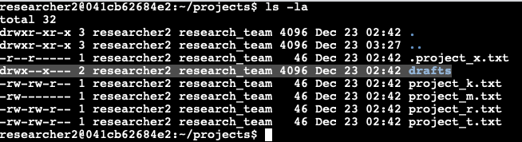

My organization only wants the researcher2 user to have access to the drafts directory and its contents. This means that no one other than researcher2 should have execute permissions.

The following code demonstrates how I used Linux commands to change the permissions:

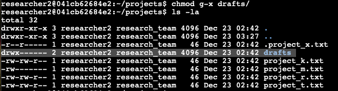

The first two lines of the screenshot display the commands I entered, and the remaining lines show the output of the second command. I previously determined that the group had execute permissions, so I used the `chmod` command to remove them. The `researcher2` user already had execute permissions, so no changes were needed for that user.


### Summary

In this activity, I examined and modified file and directory permissions using Linux commands. Key tasks included reviewing permissions with `ls -la`, interpreting permission strings, and updating access using `chmod` to comply with security policies. These actions ensured that unauthorized access was removed and that only the appropriate users retained the necessary permissions. This exercise highlights the importance of understanding and applying Linux file permission management for maintaining secure systems.

### Sources

- [The Linux Documentation Project – File Permissions](https://tldp.org/LDP/intro-linux/html/sect_03_04.html)
- [GNU Coreutils: ls](https://www.gnu.org/software/coreutils/ls)
- [GNU Coreutils: chmod](https://www.gnu.org/software/coreutils/chmod)
- [Understanding Linux File Permissions – Linuxize](https://linuxize.com/post/understanding-linux-file-permissions/)


---

## Project 5: Applying filters to SQL queries

### Project Description

As a security professional, my role is to investigate potential vulnerabilities, secure the system, and facilitate updates to employee machines where necessary. This document showcases how I utilized SQL filters to address security challenges, analyze login activity, and retrieve targeted employee data for further actions.

### Retrieve after hours failed login attempts

**Query:**

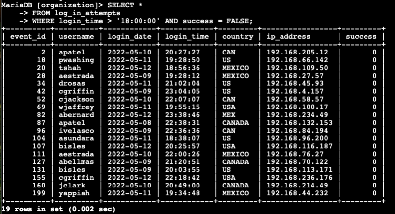

**Explanation:**  
This query identifies failed login attempts that occurred after business hours. First, I selected all records from the `log_in_attempts` table. Then, I added a `WHERE` clause with two conditions connected by the `AND` operator. The first condition, `login_time > '18:00'`, filters for login attempts made after 6:00 PM, and the second condition, `success = 0`, ensures that only failed login attempts are returned. This approach helps narrow down potentially suspicious activities.

**Output:**  
The output included rows of failed login attempts with their respective timestamps and user IDs, allowing further investigation of after-hours access attempts.

### Retrieve login attempts on specific dates

**Query:**

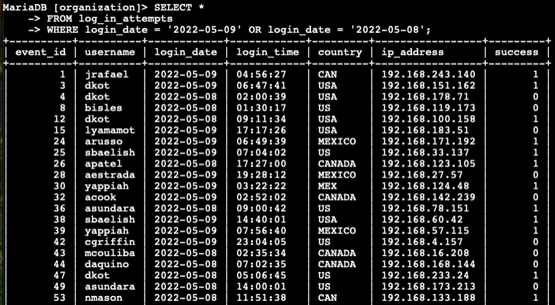


**Explanation:**  
This query filters for login attempts that occurred on May 8 or May 9, 2022. First, I selected all data from the `log_in_attempts` table. Then, I used a `WHERE` clause with an `OR` operator to include records matching either of the two specified dates. The first condition, `login_date = '2022-05-09'`, filters for login attempts on May 9, while the second condition, `login_date = '2022-05-08'`, filters for login attempts on May 8. This allows for a comprehensive review of activity over both days.

**Output:**  
The results displayed login details, including user IDs and times, for all login attempts on the specified dates, enabling targeted investigation.


### Retrieve login attempts outside of Mexico

**Query:**

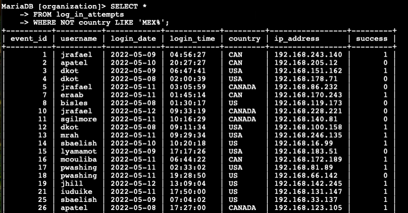
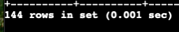

**Explanation:**  
This query filters out login attempts originating from Mexico. First, I selected all records from the `log_in_attempts` table. Then, I used a `WHERE` clause with `NOT LIKE` to exclude entries where the `country` column matches "MEX%" or "MEXICO." The `%` wildcard accounts for variations in how the country is represented, ensuring all references to Mexico are excluded.

**Output:**  
The output included login attempts from countries other than Mexico, detailing timestamps and user IDs for further investigation.


### Retrieve employees in Marketing

**Query:**

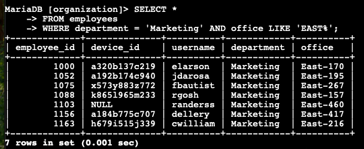

**Explanation:**  
This query retrieves employees in the Marketing department who work in the East building. I started by selecting all records from the `employees` table. Then, I added a `WHERE` clause with two conditions connected by the `AND` operator. The first condition, `department = 'Marketing'`, filters for employees in the Marketing department. The second condition, `office LIKE 'East-%'`, ensures that only employees working in the East building are included. The `%` wildcard captures any variations in office numbers within the East building.

**Output:**  
The results showed a list of Marketing employees working in the East building, along with their office numbers and job titles.


### Retrieve employees in Finance or Sales

**Query:**

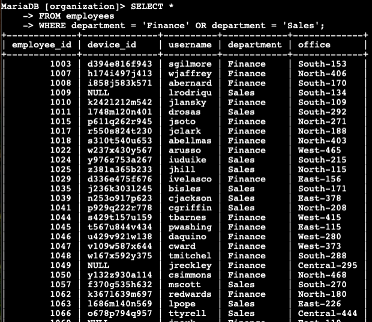
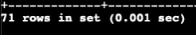

**Explanation:**  
This query retrieves employees in either the Finance or Sales departments. First, I selected all records from the `employees` table. Then, I used a `WHERE` clause with an `OR` operator to include records that match either condition. The first condition, `department = 'Finance'`, filters for employees in Finance, and the second condition, `department = 'Sales'`, filters for employees in Sales. This approach ensures that all relevant employees are captured.

**Output:**  
The query returned employees from both departments, listing their names, department affiliations, and office locations.


### Retrieve all employees not in IT

**Query:**

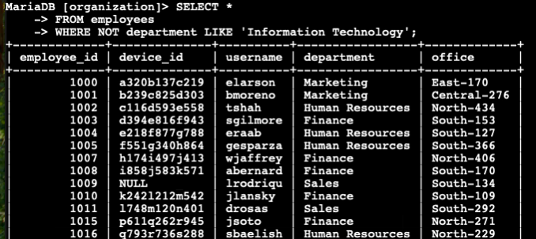


**Explanation:**  
This query filters for employees who are not part of the Information Technology department. First, I selected all records from the `employees` table. Then, I added a `WHERE` clause with `NOT LIKE` to exclude records where the `department` column starts with "Information Technology." This ensures that employees from other departments are included while accounting for potential variations in how the department is named.

**Output:**  
The output listed employees from all departments except IT, along with their job titles and office locations, facilitating updates for their systems.


### Summary

I applied filters to SQL queries to retrieve specific information on login attempts and employee machines. By using the `log_in_attempts` and `employees` tables, I demonstrated how to apply `AND`, `OR`, and `NOT` operators to refine results based on various conditions. Additionally, I used `LIKE` and the `%` wildcard to search for patterns effectively. These techniques supported identifying suspicious login activities and retrieving targeted employee data for security updates, ensuring the organization’s systems remain secure.


---

## Project 6: Analyze vulnerable system for a small business

# Vulnerability Assessment Report
**Date:** 1st January 20XX

---

## System Description

The server hardware consists of a powerful CPU processor and 128GB of memory. It runs on the latest version of the Linux operating system and hosts a MySQL database management system. The server is configured with a stable network connection using IPv4 addresses and interacts with other servers on the network. Security measures include SSL/TLS encrypted connections to protect data in transit.

---

## Scope

This vulnerability assessment focuses on the current access controls of the system. The assessment covers a three-month period, from June 20XX to August 20XX, and follows the guidelines outlined in **NIST SP 800-30 Rev. 1** for risk analysis of information systems.

---

## Purpose

The database server serves as a centralized repository for storing and managing critical business data. It holds customer leads, sales information, and essential marketing data—including customer, campaign, and analytic details—that drive both operational and strategic decisions. Securing this data is crucial to maintaining consumer trust, ensuring regulatory compliance, and preserving the company’s competitive edge. Given that the server is publicly accessible, it is imperative to address potential vulnerabilities that could lead to data leakage, manipulation, or system downtime.

---

## Risk Assessment

The risk assessment identifies key threat events and evaluates them based on their likelihood and potential impact on business operations. The following table summarizes the main threats:

| **Threat Source**      | **Threat Event**                               | **Likelihood (1-3)** | **Severity (1-3)** | **Risk (L x S)** |
|------------------------|------------------------------------------------|----------------------|--------------------|------------------|
| Competitor / Hacker    | Obtain sensitive information via exfiltration  | 3                    | 3                  | 9                |
| Hacktivist / APT       | Conduct Denial-of-Service (DoS) attack         | 2                    | 3                  | 6                |
| Insider / Employee     | Alter or delete critical information           | 2                    | 2                  | 4                |

**Notes:**

- **Competitor/Hacker:** Unauthorized access leading to data exfiltration poses a significant threat, given the high value of the stored information.
- **Hacktivist/APT:** A successful DoS attack could disrupt critical operations, impacting system availability and business continuity.
- **Insider/Employee:** Malicious or accidental actions by privileged users can compromise data integrity, though the impact is somewhat lower compared to external threats.

---

## Approach

Risk identification and scoring were conducted by evaluating both the technical capabilities of potential threat actors and the impact that a security incident would have on the organization. The chosen threat events represent common and impactful attack vectors for a publicly accessible database:

- **Data Exfiltration:** Directly threatens the organization’s competitive position.
- **Denial-of-Service Attacks:** Disrupts vital business operations.
- **Insider Threats:** Can lead to unauthorized changes or deletions of critical data.

The risk scores (likelihood and severity) are assigned to reflect the current security posture and the operational importance of the data stored on the server.

---

## Remediation Strategy

A layered security (defense in depth) approach is recommended to mitigate identified risks. Key recommendations include:

- **Access Controls:**
  - Implement multi-factor authentication (MFA) and role-based access controls to ensure that only authorized personnel have access to sensitive data.
  - Enforce the principle of least privilege to limit the risk from insider threats.

- **Network Security:**
  - Deploy intrusion detection and prevention systems (IDS/IPS) combined with continuous network monitoring to detect and mitigate potential DoS attacks.
  - Use IP allow-listing for critical access points, ensuring that only traffic from corporate offices or other trusted networks is permitted.

- **Data Encryption:**
  - Transition from SSL to TLS for encrypting data in transit, providing a stronger security posture against interception and tampering.

- **Audit and Monitoring:**
  - Strengthen audit trails and implement strict change-management procedures to detect and respond quickly to any unauthorized activity or data alterations.

Integrating these measures will help reduce the overall attack surface and enhance the security posture of the information system, safeguarding critical business operations and maintaining consumer trust.

## Sources

- **NIST SP 800-30 Rev. 1:** Guide for Conducting Risk Assessments. [NIST Publication](https://csrc.nist.gov/publications/detail/sp/800-30/rev-1/final)
- **NIST SP 800-53:** Security and Privacy Controls for Information Systems and Organizations. [NIST Publication](https://csrc.nist.gov/publications/detail/sp/800-53/rev-5/final)
- **OWASP:** Top Ten Project – for insights on common web vulnerabilities. [OWASP Top 10](https://owasp.org/www-project-top-ten/)

---

## Project 7: Document an incident with an incident handlers journal


### Entry 001

| **Date**              | January 9, 2025                                                                                                                         |
|-----------------------|-----------------------------------------------------------------------------------------------------------------------------------------|
| **Entry**             | 001                                                                                                                                     |
| **Description**       | A ransomware attack disrupted operations at a small healthcare clinic due to phishing emails. This incident falls under the **Detection and Analysis** and **Containment, Eradication, and Recovery** phases of the NIST Incident Response Lifecycle, as the attack was identified, and steps were taken to mitigate the impact. |
| **Tool(s) used**      | None mentioned in the scenario for prevention or remediation                                                                             |
| **The 5 W’s**         | **Who caused the incident?**<br>- An organized group of unethical hackers targeting healthcare and transportation industries.<br><br>**What happened?**<br>- Employees downloaded phishing email attachments containing ransomware, encrypting critical company files.<br><br>**When did the incident happen?**<br>- Tuesday at approximately 9:00 a.m.<br><br>**Where did the incident happen?**<br>- A small U.S. healthcare clinic.<br><br>**Why did the incident happen?**<br>- Attackers exploited employees via phishing emails, allowing them to gain network access and deploy ransomware. |
| **Additional notes**  | - Highlights the need for **employee training** in recognizing phishing emails.<br>- Reinforces the importance of **robust cybersecurity measures** (email filtering, endpoint protection).<br>- Demonstrates the potential for **operational disruption** and reputational harm in critical sectors like healthcare. |


### Entry 002

| **Date**              | January 24, 2025                                                                                                                         |
|-----------------------|-----------------------------------------------------------------------------------------------------------------------------------------|
| **Entry**             | 002                                                                                                                                     |
| **Description**       | An investigation using Splunk Cloud identified multiple failed SSH login attempts on the mail server of Buttercup Games. This incident is categorized under **Detection and Analysis**, as log monitoring helped uncover unauthorized access attempts. **Preparation** is also relevant, as security monitoring tools were in place for proactive defense. |
| **Tool(s) used**      | Splunk Cloud                                                                                                                             |
| **The 5 W’s**         | **Who caused the incident?**<br>- Unauthorized users attempting to access the mail server via SSH.<br><br>**What happened?**<br>- Multiple failed SSH login attempts for the root account were detected in the logs.<br><br>**When did the incident happen?**<br>- Over a period of time, as observed in the security logs. (Exact timestamps from Splunk: 06/03/2023 - 01:39:51).<br><br>**Where did the incident happen?**<br>- The unauthorized access attempts targeted the mail server (mailsv) of Buttercup Games.<br><br>**Why did the incident happen?**<br>- The failed SSH login attempts suggest either a brute force attack or unauthorized access attempts by an external actor. |
| **Additional notes**  | - Splunk query used: `index=main host=mailsv fail* root`<br>- Over **100 failed SSH login attempts** were identified.<br>- **Next Steps**:<br>  • Investigate source IPs.<br>  • Set up alerts in Splunk for repeated failed logins.<br>  • Review access control policies and strengthen authentication. |


### Entry 003

| **Date**              | January 25, 2025                                                                                                                         |
|-----------------------|-----------------------------------------------------------------------------------------------------------------------------------------|
| **Entry**             | 003                                                                                                                                     |
| **Description**       | An investigation using Suricata detected suspicious HTTP traffic matching a custom alert rule, suggesting reconnaissance or exploitation attempts. This falls under **Detection and Analysis**, as network monitoring was used to detect potential threats. The next steps involve **Containment and Eradication** to mitigate further risks. |
| **Tool(s) used**      | Suricata                                                                                                                                |
| **The 5 W’s**         | **Who caused the incident?**<br>- Potential unauthorized users attempting to access network resources.<br><br>**What happened?**<br>- Suricata detected suspicious HTTP traffic matching a custom alert rule, indicating possible reconnaissance or exploitation attempts.<br><br>**When did the incident happen?**<br>- November 23, 2022, at 12:38:34 UTC and 12:38:58 UTC.<br><br>**Where did the incident happen?**<br>- Unauthorized traffic was observed leaving the internal network ($HOME_NET) towards external destinations ($EXTERNAL_NET).<br><br>**Why did the incident happen?**<br>- The triggered Suricata rule suggests that external entities attempted to make GET requests, potentially probing for vulnerabilities. |
| **Additional notes**  | - Suricata rules were tested using `sample.pcap` and `custom.rules`.<br>- Alerts were logged in `fast.log` and `eve.json`.<br>- Destination IPs: `142.250.1.139`, `142.250.1.102`.<br>- **Next Steps**:<br>  • Investigate source IPs and associated activities.<br>  • Set up additional Suricata rules to detect similar patterns.<br>  • Implement firewall rules or IPS configurations to mitigate potential threats. |

---

## Entry 004

| **Date**              | January 25, 2025                                                                                                                         |
|-----------------------|-----------------------------------------------------------------------------------------------------------------------------------------|
| **Entry**             | 004                                                                                                                                     |
| **Description**       | An investigation into a phishing attempt targeting an employee via a malicious email attachment. This falls under **Detection and Analysis** as well as **Post-Incident Activity**, as the attack was identified and lessons were documented to enhance future response strategies. |
| **Tool(s) used**      | - Email Security Gateway<br>- Threat Intelligence Database<br>- Antivirus/Malware Analysis Tool<br>- Network Traffic Analysis (IDS/IPS)  |
| **The 5 W’s**         | **Who caused the incident?**<br>- An external threat actor using the alias "Def Communications" with domain `7tgyuyhh6tgftrt7tg.su`.<br><br>**What happened?**<br>- A phishing email containing a password-protected malicious attachment (`bfsvc.exe`) was sent to `hr@inergy.com`. The file was downloaded and executed, confirmed as malware via hash analysis.<br><br>**When did the incident happen?**<br>- July 20, 2022, at 09:30:14 AM UTC.<br><br>**Where did the incident happen?**<br>- The phishing email targeted an employee at Inergy, reaching their email infrastructure and endpoint.<br><br>**Why did the incident happen?**<br>- The email bypassed security filters due to the password-protected attachment, preventing automated malware scanning. |
| **Additional notes**  | - The file hash `54e6ea47eb04634d3e87fd7787e2136ccfbcc80ade34f246a12cf93bab527f6b` was confirmed malicious.<br>- The sender’s domain did not match the sender’s name, a common phishing indicator.<br>- **Next Steps**:<br>  • Perform full forensic analysis on the affected system.<br>  • Block sender’s domain and IP at the email gateway and firewall.<br>  • Implement additional email filtering rules for password-protected attachments.<br>  • Provide security awareness training on phishing techniques. |


### Entry 005

| **Date**              | January 25, 2025                                                                                                                         |
|-----------------------|-----------------------------------------------------------------------------------------------------------------------------------------|
| **Entry**             | 005                                                                                                                                     |
| **Description**       | A security incident affected customer PII and financial data due to a forced browsing vulnerability in an e-commerce web application. This falls under **Detection and Analysis** (breach identified) and **Containment, Eradication, and Recovery** (mitigation steps were implemented). |
| **Tool(s) used**      | - Web Application Logs<br>- Security Incident Investigation Procedures                                                                   |
| **The 5 W’s**         | **Who caused the incident?**<br>- An external attacker exploiting a forced browsing vulnerability.<br><br>**What happened?**<br>- An attacker gained unauthorized access to customer transaction data by modifying order numbers in a purchase confirmation page URL, leading to the theft of 50,000 customer records.<br><br>**When did the incident happen?**<br>- The breach was confirmed on December 28, 2022, after an attacker emailed an employee with ransom demands.<br><br>**Where did the incident happen?**<br>- The e-commerce web application’s purchase confirmation pages.<br><br>**Why did the incident happen?**<br>- A vulnerability allowed forced browsing, exposing sensitive customer data. |
| **Additional notes**  | - The attacker attempted extortion, demanding cryptocurrency payments.<br>- Logs revealed abnormal sequential order access patterns.<br>- **Next Steps**:<br>  • Conduct routine vulnerability scans and penetration testing.<br>  • Implement URL access controls and authentication mechanisms.<br>  • Strengthen incident response procedures and user data protection. |


### Reflections/Notes

- **Were there any specific activities that were challenging for you? Why or why not?**  
  Some activities required complex log analysis, which was initially challenging, but practice improved proficiency.

- **Has your understanding of incident detection and response changed since taking this course?**  
  Yes, I now have a structured approach to incident handling based on NIST guidelines.

- **Was there a specific tool or concept that you enjoyed the most? Why?**  
  I enjoyed working with Splunk and Suricata because they provided real-time insights into security events, making threat detection more effective.


---

## Project 8: Update a file through a Python algorithm

### Algorithm for file updates in Python

### Project Description

At my organization, we manage access to sensitive content using an approved list of IP addresses stored in a file named `allow_list.txt`. We also maintain a separate list of IP addresses that should no longer have access. To streamline our process, I developed an algorithm that automatically updates the allow list by removing any IP addresses found in the removal list.

## Step 1: Open the Allow List File
The initial step of the algorithm involves working with the `allow_list.txt` file, which contains all the permitted IP addresses. First, the file name is stored in a variable called `import_file`:

```python
import_file = "allow_list.txt"
```

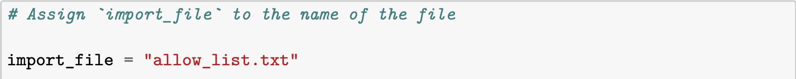

Next, I use a with statement to open the file in read mode. The with statement calls the open() function with two parameters: the file name (`import_file`) and the mode "r", which specifies that the file should be opened for reading. By using with, the file is automatically closed once the block of code is finished executing, which helps manage system resources efficiently. Additionally, I assign the resulting file object to a variable named `file`, making it easy to access the file’s contents while working within the with block:

```python
with open(import_file, "r") as file:
```
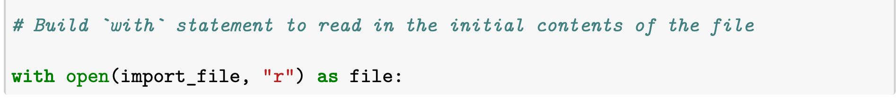

This approach ensures that I can safely and effectively read the IP addresses from the file without having to worry about manually closing it afterward.


### Read the file contents

To capture the file's contents as a string, I leveraged Python's .read() method. Here’s a breakdown of the process in my own words:

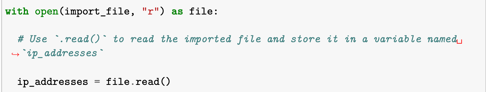

1. Opening the File  
I open the "allow_list.txt" file using a with statement in read mode. This not only makes the file available for reading but also ensures it’s automatically closed after the operations are complete.

2. Reading the File Content  
Inside the with block, I invoke the .read() method on the file object. This method reads the entire file and converts its contents into a single string. I then assign this string to a variable named ip_addresses.

3. Purpose and Benefits  
The main goal here is to load all the IP addresses from "allow_list.txt" into the ip_addresses variable. Converting the file content to a string makes it easier to later parse and manipulate the data. Additionally, using the with statement helps manage system resources by ensuring the file is properly closed after reading.

In summary, this approach reads the contents of "allow_list.txt" into a string, storing it in ip_addresses, which can then be processed to extract or organize the IP addresses as needed in the program.
